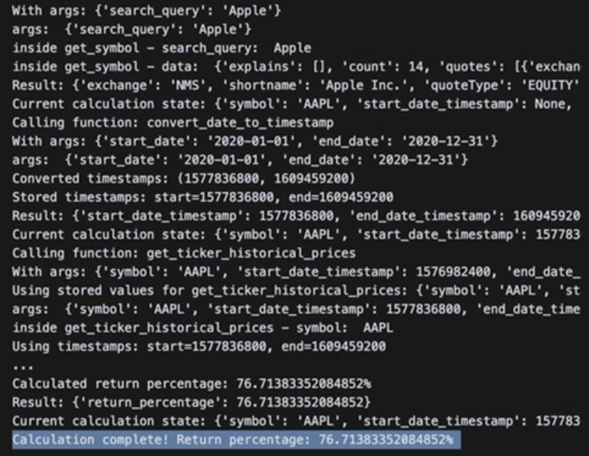

# Build an Equity Backtester AI agent from scratch with python using open/free LLM APIs

## Introduction

the rise of AI agents intrigued me quite a bit with the use of Cursor's agent which nowadays writes most of the code for me, so i dwelled into it and stumbled upon [this Anthropic blog post](https://www.anthropic.com/engineering/building-effective-agents) which was interesting and i thought of building an agent for my own use case to just to submerge myself into this agentic world to better understand the underlying workings of it and eventually learn the best practices along with it.

I didn't wanted to use any of the frameworks like LangChain, LangGraph, CrewAI, etc since i want to get my hands dirty by building it first hand from scratch by just using the LLM APIs.

As the first step, I had to pick a use case, a problem to solve, a simple one to start with.

most of us would have seen posts like this:
 
which says: "10K bucks invested in so and so company would've become so & so much by now", but i haven't seen a tool to validate if the content in that meme is correct or not. For anyone from the financial markets, this is easy-peasy but for a commoner it isn't, albeit, today it is because when you put that query into Google search, it gives out almost a perfect answer to it but for this use case i'd like to take this simple idea and build an AI agent to backtest & calculate the returns for the same query, 
##### Our Goal
if I ask the agent: "I want to know how much I would have made if I had invested in amazon from 2023-01-01 to 2023-12-31" 
and i want the agent to return the result saying something like this: "You would have made 77% returns on your investment during this period." (yeah that's the approximate returns which i had calculated from TradingView app)

Btw, I haven't seen any tool doing this either so probably a good start to build a tool that doesn't exist. 
note: google search gives out results only for the popular stocks, so we'll probably do a better job here by letting the users to backtest(when we run any analytics over historical data, it's called backtesting in the financial world) any stock across the financial markets.


like all AI/ML enthusiasts, I'd prefer Python for this one as well.


## Solution on a high level:
the user inputs the query to the AI agent and the agent extracts the information from the query required for backtesting and returns a summary of text describing how much returns the users would have made during the period specified in the query.
firstly, let's break down the solution into sub tasks like we all usually do:
- extract company name, start date, end date from the user's query input text
- format the extracted input in a consumable format to request info from the APIs
- fetch the symbol from the API for the given company name
- fetch the historical price data of the symbol for the start date & end date from the API
- calculate the returns based on the historical price of the symbol for the given period
- generate a summary in a user readable format and present it to the user


hmm, now we're good to proceed with the development, the juicy part 🥤

lets dive right into it...

> NOTE: if you don't wish to know the setup from scratch then feel free to go through the codebase directly

> this blog post covers only the `function calling` based implementation, I've also made a separate implementation with prompt chaining, structured/model-led data handling & gate keeping, take a peek at `backtester_agent_prompt_chained.py`, the code is self-explanatory, if you're just interested in building AI agents with more fine-grained control

## Setup:
install [LMStudio app](https://lmstudio.ai/) [I prefer it because it allows us to install the open models from hugging face]

download the models of your choice but for this demonstration, I've downloaded these deepseek models:
- deepseek-r1-distill-llama-8b
- deepseek-r1-distill-qwen-7b

make sure LMStudio localhost API is running from the `Developer` tab and must be reachable at `http://127.0.0.1:1234`

install the required python extensions to have intellisense, .venv, jupyter notebooks and others as you wish.

create a `.env` file and put these values:
```
YAHOO_FINANCE_QUERY_API=
YAHOO_FINANCE_SEARCH_API=
```
> Tip: i wish to not reveal these APIs since they're not public but you can take these urls from the yahoo site by searching for a symbol

create a `equity_backtest_ai_agent_tryout` folder and `requirements.txt` file into it with these dependencies:
- requests (to make http requests / api calls)
- ipykernel (to run the agent interactively with jupyter notebook)
- python-dotenv (to read env vars)
- [openai](https://github.com/openai/openai-python?tab=readme-ov-file) (to simplify making LLM API calls)

make sure to configure `.venv` [N.B: its easily done with extensions and add it in the .gitignore]

install the dependencies with `pip install -r requirements.txt`

create `backtester_agent.py` and import the required ones:
```python
from openai import OpenAI
import requests
from dotenv import load_dotenv

load_dotenv()
```

lets create an OpenAI client pointed to our localhost API:
```python
client = OpenAI(
    base_url="http://127.0.0.1:1234/v1",
    api_key="something",
)
```

this is the API where the magic happens:
```python
completion = client.chat.completions.create(
            model=model,
            messages=messages,
            tools=tools,
        )
```
`model` - represents the model name we're trying to use
`messages` - represents an array of messages accumulated to give a context to the model

`tools` - in a way, the agentic systems are all using the [function calling](https://platform.openai.com/docs/guides/function-calling), synonymously referred as `tools` as well representing a collection of functions
we'll be doing the same now but before that we need to write the unit functions for the tasks we've broken down & listed above, lets write those functions first.

NOTE: please refer the codebase for the full implementation as putting all the code here would be redundant and would make it elongated one but laying out the approach of how i went about implementing this agent

```python
def get_symbol(search_query: str):
```
_gets user query as input and returns a valid symbol_
```python
def get_ticker_historical_prices(symbol: str, start_date_timestamp: int, end_date_timestamp: int):
```
_gets a valid symbol and start/end timestamp values and returns start/end price_

```python
def convert_date_to_timestamp(start_date: str, end_date: str):
```
_converts the given date strings into unix timestamp values_
```python
def get_return_percentage(start_date_timestamp_price: float, end_date_timestamp_price: float):
```
_calculates the return percentage based on the given start/end prices_

> _NOTE: you can replace Yahoo Finance API with any other API by simply modifying these 2 functions[`get_symbol`, `get_ticker_historical_prices`] to return the appropriate response_

and we need to define the tools array for every single function to pass it as a tool to the LLM API and the format of it goes like this:
```python
tools = [
    {
        "type": "function",
        "function": {
            "name": "get_symbol",
            "description": "Get symbol for a given search query.",
            "parameters": {
                "type": "object",
                "properties": {
                    "search_query": {"type": "string"},
                },
                "required": ["search_query"],
                "additionalProperties": False,
            },
            "strict": True,
        },
    },
    .... add other functions here
]
```


and we need a generic function to make sure we have a single entry point to call any tools when the LLM requests for it
```python
def call_function(name, args):
    try:
        if name == "get_symbol":
            return get_symbol(**args)
        elif name == "convert_date_to_timestamp":
            return convert_date_to_timestamp(**args)
        elif name == "get_ticker_historical_prices":
            return get_ticker_historical_prices(**args)
        elif name == "get_return_percentage":
            return get_return_percentage(**args)
        else:
            print(f"Unknown function: {name}")
            return None
    except Exception as e:
        print(f"Error calling function {name}: {e}")
        return None

```

now lets define a `system_prompt` string, this is the initial message that goes into the messages array in this format:
```python
messages = [
    {"role": "system", "content": system_prompt},
    {"role": "user", "content": "What would have been the return of Apple from 2020-01-01 to 2020-12-31?"}
]
```
i think `system_prompt` is like the soul where i spent most of the time tweaking & adding as many rules as possible to sure that the model performs exactly the steps as i want it to do so. (look into the code to check the hugely tweaked prompt which worked)

once we have defined all required setup, we need to make the call to the LLM:
```python
completion = client.chat.completions.create(
    model=model,
    messages=messages,
    tools=tools,
)
```
which would respond back with either a message or a tool_calls or finish_reason, in this format:
```json
{
  "id": "chatcmpl-bgfpcnybizo8v2u15tt7de",
  "object": "chat.completion",
  "created": 1742140710,
  "model": "deepseek-r1-distill-qwen-7b",
  "choices": [
    {
      "index": 0,
      "logprobs": null,
      "finish_reason": "tool_calls",
      "message": {
        "role": "assistant",
        "tool_calls": [
          {
            "id": "429075417",
            "type": "function",
            "function": {
              "name": "get_symbol",
              "arguments": "{\"search_query\":\"Apple\"}"
            }
          }
        ]
      }
    }
  ],
  "usage": {
    "prompt_tokens": 1176,
    "completion_tokens": 542,
    "total_tokens": 1718
  },
  "stats": {},
  "system_fingerprint": "deepseek-r1-distill-qwen-7b"
}
```
in which case we can make the call to the generic function we've defined: `call_function` and return back the response from the function back to the LLM by concatenating with the previous messages array until the model returns a `finish_reason` in the response, this is the essence of how an agent could be built but it is not as simple as that since there are many issues that would popup like data hallucinations, tool calls in a loop when we don't define a limit, confuse the numbers between timestamps & prices and many more.

I've laid down the problems I faced while developing this agent on a very high level along with the solutions that worked for this use case.

### Inconsistent Agent Behavior - Debugging

The Backtester agent was designed to perform a simple sequence of operations:
1. Extract company name and date range from user queries
2. Get the stock symbol
3. Convert dates to timestamps
4. Fetch historical prices
5. Calculate the return percentage

Despite this clear workflow, the agent would frequently:
- Get stuck in infinite loops
- Skip necessary tool calls
- Hallucinate data instead of using API results
- Confuse timestamps with price values
- Fail to output the final result

Let's dive into each issue and how I solved them.

#### Issue 1: Infinite Loops and Inconsistent Execution

##### Problem
The agent would sometimes get stuck in a loop, repeatedly calling the same function with the same arguments, or fail to complete the entire sequence of tool calls.

##### Solution
I implemented several safeguards:
```python
# Set a maximum number of iterations
MAX_ITERATIONS = 10
iteration_count = 0

# Track previous tool calls to detect loops
previous_tool_calls = set()

# Create a unique identifier for each tool call
tool_call_id = f"{name}:{json.dumps(args, sort_keys=True)}"

# Check if we've seen this exact tool call before
if tool_call_id in previous_tool_calls:
    print(f"Detected repeated tool call: {tool_call_id}")
    messages.append({
        "role": "system", 
        "content": f"You've already called {name} with these arguments..."
    })
    continue
```

This approach effectively prevented the agent from getting stuck in loops by tracking and rejecting repeated tool calls.

#### Issue 2: Hallucinated Responses

##### Problem
The model would sometimes skip calling tools entirely and just make up an answer, or hallucinate values instead of using the actual data returned by the API calls.

##### Solution
I enhanced the system prompt with explicit instructions and implemented state tracking:

```python
system_prompt = """
CRITICAL RULES:
- NEVER skip any of the required tool calls
- NEVER provide an answer without completing ALL tool calls in the correct sequence
- NEVER make up or hallucinate any data - use ONLY the data returned by the tools
- NEVER attempt to calculate returns yourself - ALWAYS use the get_return_percentage tool
"""

# Track the state of the calculation
calculation_state = {
    "symbol": None,
    "start_date_timestamp": None,
    "end_date_timestamp": None,
    "start_date_timestamp_price": None,
    "end_date_timestamp_price": None,
    "return_percentage": None
}
```

I also added validation to ensure the model couldn't finish without completing all required steps:

```python
if calculation_state["return_percentage"] is None:
    # Force it to continue
    messages.append({
        "role": "system",
        "content": "You must complete the full sequence of tool calls..."
    })
    continue
```

#### Issue 3: Parameter Confusion

##### Problem
The model would confuse timestamps with price values, trying to calculate returns using timestamps or passing price values to functions expecting timestamps.

##### Solution
I implemented extensive type validation and parameter overriding:

```python
# Validate input types
if not isinstance(start_date_timestamp, int):
    print(f"Error: start_date_timestamp must be an integer, got {type(start_date_timestamp)}")
    return None

# Always override the arguments with stored values to prevent hallucination
args = {
    "symbol": calculation_state["symbol"],
    "start_date_timestamp": calculation_state["start_date_timestamp"],
    "end_date_timestamp": calculation_state["end_date_timestamp"]
}

# Add explicit reminders to the model
messages.append({
    "role": "system",
    "content": f"Using the following values for historical prices: symbol={calculation_state['symbol']}, start_timestamp={calculation_state['start_date_timestamp']}, end_timestamp={calculation_state['end_date_timestamp']}"
})
```

This ensured that the correct values were always used, regardless of what the model tried to pass.

#### Issue 4: Failure to Output Results

##### Problem
Even when the calculation was successful, the agent would sometimes continue iterating and fail to output the final result.

##### Solution
I implemented an immediate termination and forced output once the calculation was complete:

```python
# If we've completed the calculation, break out of the loop
if name == "get_return_percentage" and calculation_state["return_percentage"] is not None:
    print(f"Calculation complete! Return percentage: {calculation_state['return_percentage']}%")
    # Force a final response with the result
    try:
        final_message = f"The return for {calculation_state['symbol']} from {messages[1]['content']} was {calculation_state['return_percentage']}%."
        final_completion = client.chat.completions.create(
            model=model,
            messages=messages + [{"role": "system", "content": final_message}],
            tools=[]
        )
        print("Final calculated response:", final_completion.choices[0].message.content)
        # Set completion to this final response so it's used at the end
        completion = final_completion
        break
    except Exception as e:
        print(f"Error getting final calculated response: {e}")
```

This ensured that as soon as the return percentage was calculated, the agent would immediately provide the final answer.

#### Key Takeaways

Building reliable AI agents requires more than just defining tools and prompts. Here are the key lessons learned:

1. **Implement safeguards against loops**: Track previous calls and limit iterations.
2. **Maintain explicit state**: Keep track of all values in a central state object.
3. **Validate inputs rigorously**: Check types and values before executing functions.
4. **Override parameters when needed**: Don't trust the model to pass the correct values.
5. **Force termination when complete**: Break out of the loop as soon as you have the result.
6. **Provide clear guidance**: Use explicit system messages to guide the model.
7. **Add detailed logging**: Log all values and states to help with debugging.

With these improvements, the equity backtester agent now reliably calculates historical returns for any stock, following the complete sequence of steps without hallucination or loops.

## Demo
here's the working demo of this agent with this user input:
> What would have been the return of Apple from 2020-01-01 to 2020-12-31?

https://github.com/user-attachments/assets/441f4f66-432a-4a01-9820-99de4784d325

## Output



## Conclusion

Finally, the Backtester agent works for any given stocks when given the correct company name and period, it responds back with the percentage returns you would have made when staying invested in the mentioned period.

Building agentic systems with LLMs requires careful handling of their quirks and limitations. By implementing proper safeguards, validation, and state management, you can create reliable agents that consistently perform complex tasks. The techniques described here can be applied to any AI agent to improve its reliability and prevent common failure modes.

Happy agent building! 